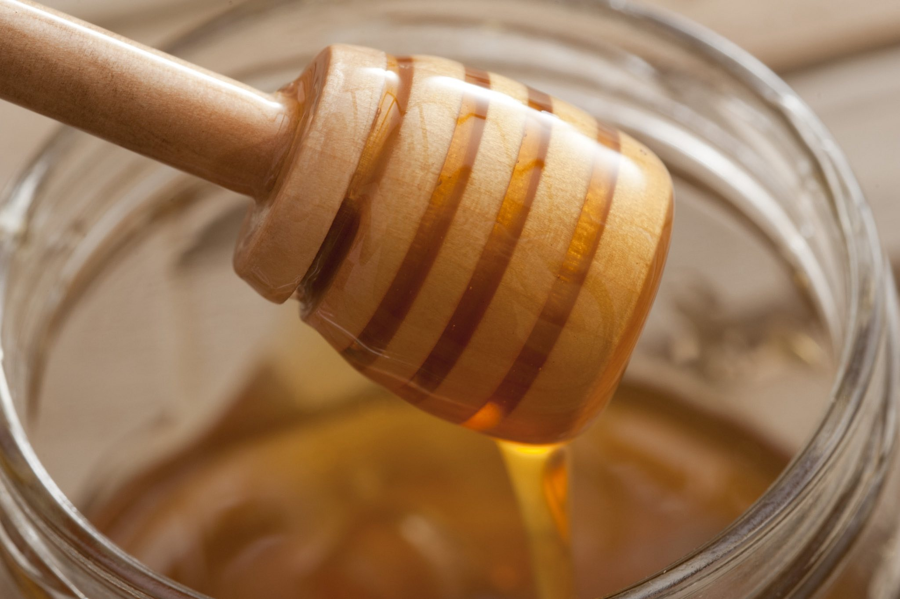

# Skattlåda: Host your own secure and easy file sharing

**Skattlåda** (pronounced _skaht-loh-dah_) is a Swedish word often used by Scandinavian beekeepers to describe the compartment in a beehive that is used to collect honey. This section of a hive is also known as the "honey super" or just the "super". While a beehive retains some of its honey to feed the colony, most of it gets shared with all of us.
